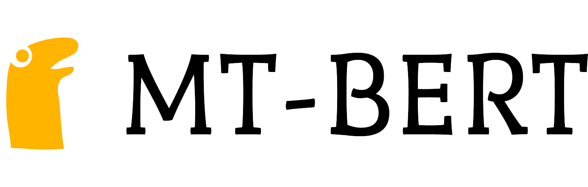

# MT-BERT




## Table of Contents

* [About the Project](#about-the-project)
  * [Built With](#built-with)
* [Getting Started](#getting-started)
  * [Prerequisites](#prerequisites)
  * [Installation](#installation)
* [Usage](#usage)
* [Authors](#authors)
* [Acknowledgments](#acknowledgments)


## About The Project

In ```MT-BERT``` we reproduce a neural language understanding model based on the [paper](https://arxiv.org/abs/1901.11504)
by Liu et al.(2019).
Such model implements a Multi-Task Deep Neural Network (MT-DNN) for learning representations across multiple NLU tasks.
MT-DNN extends the model proposed in [paper](https://www.aclweb.org/anthology/N15-1092/) by Liu et al.(2015) by incorporating a pre-trained bidirectional transformer language model, known as [BERT](https://arxiv.org/abs/1810.04805).

More details about the project are available in the [presentation](docs/MT_BERT.pdf)

Original implementation available at [repo](https://github.com/namisan/mt-dnn)

### Built With

* [Python](https://www.python.org/)
* [PyTorch](https://pytorch.org/)
* [🤗Transformers](https://huggingface.co/transformers/)
* [🤗Datasets](https://huggingface.co/docs/datasets/)
* [scikit-learn](https://scikit-learn.org/stable/)
* [SciPy](https://www.scipy.org/)
* [pytroch_warmup](https://github.com/Tony-Y/pytorch_warmup)


## Getting Started

To get a local copy up and running follow these simple steps.

### Prerequisites

The project provide a ```Pipfile``` file that can be managed with [pipenv](https://github.com/pypa/pipenv).
```pipenv``` installation is **strongly encouraged** in order to avoid dependency/reproducibility problems.

* pipenv
```sh
pip install pipenv
```

### Installation
 
1. Clone the repo
```sh
git clone https://gitlab.com/reddeadrecovery/mt-bert
```
2. Install Python dependencies
```sh
pipenv install
```

## Usage
Here's a brief description of each and every file in the repo:

* ```model.py```: Model definition
* ```task.py```: Task dataset preprocessing and definition
* ```train_glue.py```: Training file for Multi task training on GLUE
* ```fine_tune_task.py```: Fine tuning, domain adaptation and single task training file
* ```utils.py```: utils file

There is also a executable jupyter notebook:```train.ipnyb```

## Authors

* [**Alberto Baldrati**](https://github.com/ABaldrati)
* [**Giovanni Berti**](https://github.com/giovanniberti)


## Acknowledgments
Machine Learning © Course held by Professor [Paolo Frasconi](https://scholar.google.com/citations?user=s3l225EAAAAJ) - Computer Engineering Master Degree @[University of Florence](https://www.unifi.it/changelang-eng.html)
